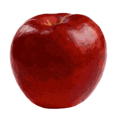

# 
# Title 

    
## Description
My description of the project

- Motivation: My motivation was this and that
- Purpose: The project solves this problem
- What i learned: I learned this and that from this project

## Table Of Contents
* [Description](#description)
* [Installation](#installation)
* [Usage](#usage)
* [Testing](#testing)
* [Credits](#credits)  
* [Questions](#questions)
* [License](#license)

## Installation
- first do this
-  then do this
-  now it's installed properly!

## Usage
This is the general description of how to use the app  

### Usage Tutorial:  

## Testing
This is how I tested my project and it works!  
  
- first do this for the test
-  then do this
-  now the test is complete and it works!

## Credits  
### Collaborators:
- this guy
-  that girl
-  this group of people

### Third Party Assets:
* [Google](https://google.com)
* [ Github]( https://github.com)

## Questions
Check out my [Github](https://github.com/BibekM)  
You can email me at: [bibekmbkb@gmail.clom](bibekmbkb@gmail.clom) with any questions about the program.

## License
    This project is licensed with Apache
